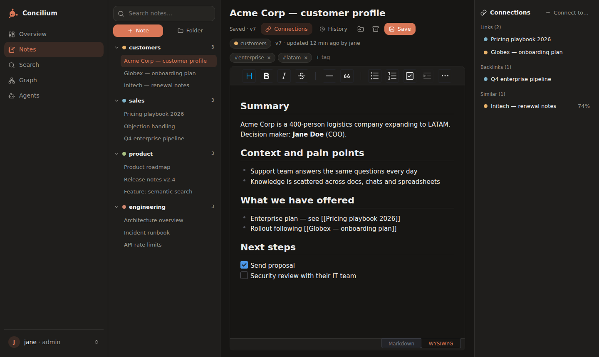
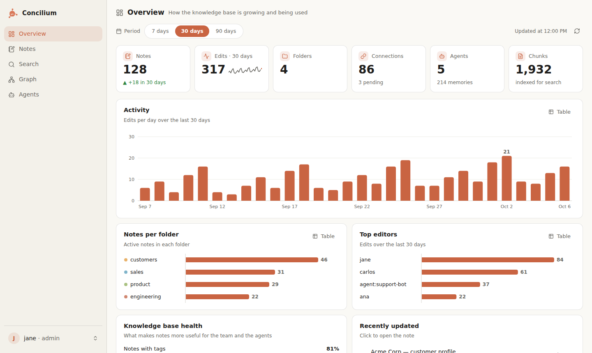
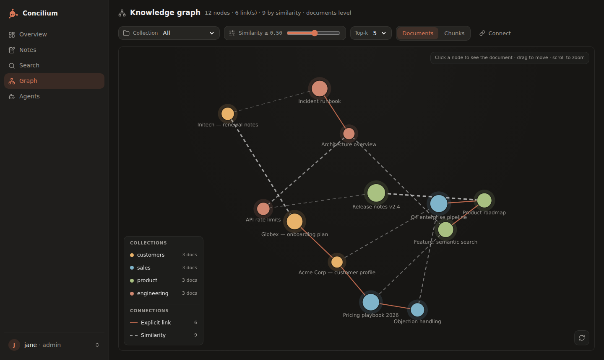
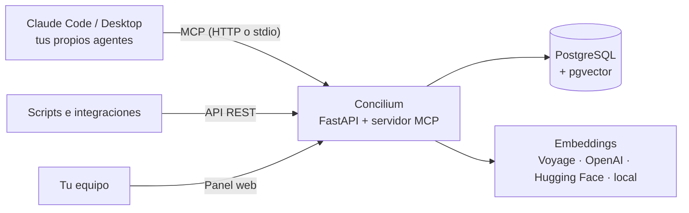

<p align="center">
  
</p>

<h1 align="center">Concilium</h1>

<p align="center">
  <strong>La base de conocimiento open source y self-hosted para agentes de IA.</strong><br />
  Un espacio de notas para el equipo, como Obsidian o Notion, que Claude y tus propios agentes pueden buscar, leer y escribir vía MCP.
</p>

<p align="center">
  <a href="README.md">English</a> · <a href="README.pt-BR.md">Português</a> · <strong>Español</strong>
</p>

<p align="center">
  
  
  
  
  
  
</p>

<p align="center">
  
</p>

---

## ¿Por qué Concilium?

Herramientas como **Obsidian**, **Notion** y **Logseq** son excelentes para las personas. Los agentes de IA, en cambio, necesitan más que una carpeta de archivos Markdown. Necesitan una búsqueda que entienda el significado, una forma segura de escribir de vuelta y una memoria que pase de un chat al siguiente.

**Concilium es un backend de RAG de verdad, no un vault de Obsidian con archivos `.md`.** Tu equipo escribe notas en un espacio web limpio. Cada nota se divide en fragmentos, se vectoriza y se indexa al guardar. Cualquier agente conectado vía **Model Context Protocol (MCP)** o por la API REST puede consultar, insertar y actualizar ese conocimiento, con control de versiones y detección de duplicados incluidos.

Los agentes también tienen un hogar: perfil (system prompt), memoria persistente, resúmenes de sesión y tareas, todo guardado en la base de datos. Un chat nuevo carga ese contexto y **continúa donde lo dejó el anterior**.

## Funcionalidades

**📝 Espacio de notas del equipo**
- Carpetas, editor visual con pestaña Markdown, etiquetas y plantillas de nota
- `[[Wikilinks]]` y retroenlaces, al estilo de Obsidian. Los enlaces a notas que aún no existen se conectan solos cuando la nota se crea
- **Importación de vaults de Obsidian**: sube el `.zip` desde el panel y sigue el progreso en tiempo real — las carpetas se convierten en colecciones, las notas en documentos completamente vectorizados, y re-importar actualiza en lugar de duplicar
- Historial de versiones con restauración, detección de conflictos y borradores locales, para que no se pierda nada

**🔎 RAG de verdad para agentes**
- Búsqueda híbrida (**semántica + texto completo**) en PostgreSQL + pgvector
- División automática en fragmentos, control de versiones y **aviso de duplicados** antes de insertar
- Upsert por id externo, para sincronizar con un CRM, un sitio de documentación o cualquier otro sistema

**🤖 Registro de agentes con memoria**
- Perfiles de agente con system prompt, alcances y las colecciones a las que cada uno puede acceder
- Memorias persistentes, resúmenes de sesión y tareas: `load_agent` lo restaura todo en un chat nuevo
- Gobernanza con humanos en el circuito: el agente **propone** cambios en su perfil, las personas los aprueban y la autonomía se activa agente por agente

**🕸️ Grafo de conocimiento**
- Grafo interactivo con enlaces explícitos y aristas de similitud semántica
- Filtro por colección, umbral de similitud o nivel de documento/fragmento, y conexión de documentos con clics

**🔐 Hecho para equipos**
- Panel con métricas de uso, probador de búsqueda RAG, claves de API con alcances y roles de usuario (lector, editor, admin)
- Tema claro y oscuro, con la interfaz en **inglés, portugués y español**
- Registro de auditoría de cada escritura, además de una API REST con documentación OpenAPI interactiva

**🔌 Embeddings intercambiables**
- Voyage AI, OpenAI, Hugging Face Inference (BAAI/bge-m3) o un modelo 100% local, todos con 1024 dimensiones
- ¿Cambiaste de proveedor? Un solo comando `reindex` recalcula todos los vectores

## Capturas

| Panel | Grafo de conocimiento |
|---|---|
|  |  |

## Concilium vs. Obsidian, Notion y bases de datos vectoriales

| | **Concilium** | Obsidian | Notion | Solo base vectorial |
|---|:---:|:---:|:---:|:---:|
| Notas del equipo con Markdown y `[[wikilinks]]` | ✅ | ✅ | ≈ (enlaces y menciones) | ❌ |
| Búsqueda híbrida semántica + texto completo nativa | ✅ | ❌ (plugins) | ≈ (Notion AI) | ≈ (solo semántica) |
| Servidor MCP para Claude y otros agentes | ✅ nativo | ≈ (plugins de la comunidad) | ✅ (alojado) | ❌ |
| Los agentes **escriben de vuelta** con versiones y control de duplicados | ✅ | ❌ | ≈ | ❌ |
| Memoria, sesiones y tareas de agentes | ✅ | ❌ | ❌ | ❌ |
| Aprobación humana de los cambios de los agentes | ✅ | ❌ | ❌ | ❌ |
| Self-hosted en tu propio PostgreSQL | ✅ | ✅ (archivos locales) | ❌ | ✅ |

<sub>La comparación considera las funcionalidades nativas. Los plugins e integraciones pueden añadir más a cada herramienta.</sub>

**Elige Concilium** si tu equipo busca una **alternativa open source a Obsidian o a Notion** pensada desde el primer día para **agentes de IA y RAG**: un único lugar donde las personas escriben y los agentes leen, buscan y aprenden.

## Inicio rápido

**Requisitos:** Python 3.11+, [uv](https://docs.astral.sh/uv/) y PostgreSQL 16 con la extensión [pgvector](https://github.com/pgvector/pgvector).

```bash
# 1. PostgreSQL con pgvector (sáltalo si ya tienes uno)
docker run -d --name concilium-db -p 5432:5432 \
  -e POSTGRES_USER=user -e POSTGRES_PASSWORD=password -e POSTGRES_DB=kb \
  pgvector/pgvector:pg16

# 2. Instalar
git clone https://gitlab.com/oadrianolucas/concilium-web-server.git
cd concilium-web-server
uv sync
cp .env.example .env   # define DATABASE_URL, EMBEDDING_PROVIDER y la clave del proveedor

# 3. Ejecutar (las tablas se crean en el primer arranque)
uv run mcp-rag-api serve            # http://localhost:8000

# 4. Crear el primer usuario del panel y abrir http://localhost:8000/dashboard
uv run mcp-rag-api create-user --username tu --role admin

# 5. Crear una clave de API admin para tus agentes (se muestra una sola vez)
uv run mcp-rag-api create-key --label yo --scopes admin
```

¿Prefieres Docker? `Dockerfile.coolify` genera la imagen de producción. `docker-compose.yml` es un ejemplo que ejecuta la API junto a un contenedor Postgres ya existente (red externa `db_network`).

## Conecta tus agentes

**Claude Code**

```bash
claude mcp add --transport http concilium http://localhost:8000/mcp \
  --header "Authorization: Bearer kb_sk_TU_CLAVE"
```

**Claude Desktop** y otros clientes locales pueden ejecutar el servidor por stdio: `uv run mcp-rag-api stdio` (la clave se lee de `KB_API_KEY`).

**Tus propios agentes** (Claude Agent SDK o cualquier cliente MCP) pueden apuntar a `https://tu-dominio/mcp` con la cabecera `Authorization: Bearer`. Todo lo demás puede usar la API REST, documentada en `/dash/docs` (requiere inicio de sesión en la dashboard).

Después, solo habla con Claude:

> Crea una colección llamada "manual" y añade nuestra política de reembolso: el cliente puede pedir un reembolso hasta 30 días después de la compra.
>
> ¿Cuál es el plazo de reembolso? Cita la fuente.
>
> Registra un agente de soporte que solo use la colección "manual" y nunca prometa reembolsos sin consultar la política.

## Cómo funciona



| Grupo de tools MCP | Tools |
|---|---|
| Base de conocimiento | `search_knowledge`, `get_document`, `list_documents`, `add_document`, `update_document`, `upsert_document`, `archive_document`, `document_history`, colecciones |
| Enlaces | `get_related`, `link_documents`, `unlink_documents`, además de `[[Título]]` en el contenido |
| Agente (sobre sí mismo) | `load_agent`, `recall`, `remember`, `forget`, `save_session`, `upsert_task`, `propose_agent_update`, … |
| Gestión | `create_agent`, `update_agent`, `set_agent_autonomy`, `review_agent_update`, `issue_agent_key`, … |

Prompts: `design_agent`, `start_as_agent`, `answer_with_sources`, `save_learning`.

## Documentación

- **[Guía completa](docs/guide.pt-BR.md)** (por ahora en portugués): instalación, todas las tools MCP, alcances, ejemplos REST, mantenimiento, solución de problemas y despliegue en producción
- Documentación interactiva de la API REST: `http://localhost:8000/dash/docs` (detrás del inicio de sesión de la dashboard)
- Arquitectura y decisiones: [PLANO.md](PLANO.md)

## Preguntas frecuentes

**¿Concilium es una alternativa a Obsidian?**
Sí, para equipos. Tienes carpetas, Markdown, `[[wikilinks]]`, retroenlaces y vista de grafo en el navegador. Además, los agentes de IA pueden buscar en cada nota vía MCP, con búsqueda semántica, control de versiones y control de acceso. No reemplaza un vault personal sin conexión: es una base de conocimiento compartida entre personas y agentes.

**¿Puede reemplazar a Notion como wiki del equipo?**
Para el conocimiento que los agentes necesitan usar, sí: perfiles de clientes, playbooks, runbooks, documentación de producto. Concilium se centra en notas, búsqueda y agentes, no en bases de datos, tableros kanban ni edición simultánea en tiempo real.

**¿Puedo importar mi vault de Obsidian o archivos Markdown?**
Envíalos por la API REST (`PUT /documents/upsert`) o pide a Claude que los añada vía MCP, y luego ejecuta `uv run mcp-rag-api relink` para resolver todos los `[[wikilinks]]`. Todavía no hay un importador de un clic.

**¿Funciona con ChatGPT, Cursor u otras herramientas de LLM?**
Cualquier cliente que hable el **Model Context Protocol** puede conectarse. Lo demás puede usar la API REST. Los embeddings no dependen del modelo de chat.

**¿Concilium es open source?**
Sí. Concilium se distribuye bajo la [Licencia Apache 2.0](LICENSE): puedes usarlo, modificarlo y alojarlo tú mismo, incluso con fines comerciales.

**¿Mis datos son privados?**
Concilium es self-hosted: notas, vectores y memorias de los agentes viven en tu propio PostgreSQL. Con el proveedor de embeddings `local`, ningún texto sale de tu servidor.

**¿Qué modelos de embeddings se admiten?**
Voyage AI (`voyage-3.5`), OpenAI (`text-embedding-3-small`), Hugging Face Inference (`BAAI/bge-m3`) y `BAAI/bge-m3` local vía sentence-transformers. Todos usan 1024 dimensiones.

## Licencia

Concilium es open source, bajo la [Licencia Apache 2.0](LICENSE).

## Stack

Python 3.12 · FastAPI · MCP Python SDK · asyncpg con SQL puro · PostgreSQL 16 + pgvector · panel en JavaScript puro (sin build) con Toast UI Editor y force-graph · uv · pytest · ruff.

---

<p align="center">
  <sub>Concilium: base de conocimiento open source y compartida, segundo cerebro y memoria RAG para equipos y sus agentes de IA.</sub>
</p>
