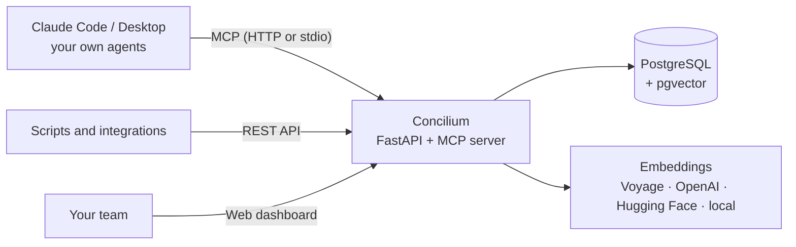

<p align="center">
  
</p>

<h1 align="center">Concilium</h1>

<p align="center">
  <strong>The open-source, self-hosted knowledge base for AI agents.</strong><br />
  A team notes workspace, like Obsidian or Notion, that Claude and your own agents can search, read and write through MCP.
</p>

<p align="center">
  <strong>English</strong> · <a href="README.pt-BR.md">Português</a> · <a href="README.es.md">Español</a>
</p>

<p align="center">
  
  
  
  
  
  
</p>

<p align="center">
  
</p>

---

## Why Concilium?

Tools like **Obsidian**, **Notion** and **Logseq** are great for people. AI agents need more than a folder of Markdown files, though. They need search that understands meaning, a way to write back safely, and memory that carries over from one chat to the next.

**Concilium is a real RAG backend, not an Obsidian vault with `.md` files.** Your team writes notes in a clean web workspace. Every note is chunked, embedded and indexed on save. Any agent connected through the **Model Context Protocol (MCP)** or the REST API can then query, insert and update that knowledge, with versioning and duplicate detection built in.

Agents also get a home: a profile (system prompt), persistent memory, session summaries and tasks, all stored in the database. A brand-new chat loads that context and **picks up where the last one left off**.

## Features

**📝 Team notes workspace**
- Folders, a WYSIWYG editor with a Markdown tab, tags and note templates
- `[[Wikilinks]]` and backlinks, Obsidian style. Links to notes that don't exist yet resolve on their own once the note is created
- **Obsidian vault import**: upload the `.zip` from the dashboard and watch real-time progress — folders become collections, notes become fully embedded documents, and re-importing updates instead of duplicating
- Version history with restore, conflict detection and local drafts, so nothing gets lost

**🔎 Real RAG for agents**
- Hybrid search (**semantic + full-text**) on PostgreSQL + pgvector
- Automatic chunking, document versioning and **duplicate warnings** before insert
- Upsert by external id, so you can sync from a CRM, a docs site or any other system

**🤖 Agent registry with memory**
- Agent profiles with system prompts, scopes and the collections each agent may access
- Persistent memories, session summaries and tasks: `load_agent` restores everything in a new chat
- Human-in-the-loop governance: agents **propose** profile changes, people approve them, and autonomy is opt-in per agent

**🕸️ Knowledge graph**
- Interactive graph of explicit links and semantic-similarity edges
- Filter by collection, similarity threshold or document/chunk level, and connect documents by clicking

**🔐 Built for teams**
- Dashboard with usage metrics, a RAG search tester, scoped API keys and user roles (viewer, editor, admin)
- Light and dark themes, with the interface in **English, Portuguese and Spanish**
- An audit log of every write, plus a REST API with interactive OpenAPI docs

**🔌 Pluggable embeddings**
- Voyage AI, OpenAI, Hugging Face Inference (BAAI/bge-m3) or a fully local model, all at 1024 dimensions
- Switched providers? A single `reindex` command recomputes every vector

## Screenshots

| Overview | Knowledge graph |
|---|---|
|  |  |

## Concilium vs. Obsidian, Notion and plain vector databases

| | **Concilium** | Obsidian | Notion | Vector DB only |
|---|:---:|:---:|:---:|:---:|
| Team notes with Markdown and `[[wikilinks]]` | ✅ | ✅ | ≈ (links and mentions) | ❌ |
| Built-in hybrid semantic + full-text search | ✅ | ❌ (plugins) | ≈ (Notion AI) | ≈ (semantic only) |
| MCP server for Claude and other agents | ✅ built in | ≈ (community plugins) | ✅ (hosted) | ❌ |
| Agents can **write back** with versioning and duplicate checks | ✅ | ❌ | ≈ | ❌ |
| Agent memory, sessions and tasks | ✅ | ❌ | ❌ | ❌ |
| Human approval for agent changes | ✅ | ❌ | ❌ | ❌ |
| Self-hosted on your own PostgreSQL | ✅ | ✅ (local files) | ❌ | ✅ |

<sub>This comparison reflects built-in features. Plugins and integrations can add more to each tool.</sub>

**Pick Concilium** if your team wants an **open-source Obsidian or Notion alternative** that is built for **AI agents and RAG** from day one: one place where people write and agents read, search and learn.

## Quick start

**Requirements:** Python 3.11+, [uv](https://docs.astral.sh/uv/), and PostgreSQL 16 with the [pgvector](https://github.com/pgvector/pgvector) extension.

```bash
# 1. PostgreSQL with pgvector (skip this if you already have one)
docker run -d --name concilium-db -p 5432:5432 \
  -e POSTGRES_USER=user -e POSTGRES_PASSWORD=password -e POSTGRES_DB=kb \
  pgvector/pgvector:pg16

# 2. Install
git clone https://gitlab.com/oadrianolucas/concilium-web-server.git
cd concilium-web-server
uv sync
cp .env.example .env   # set DATABASE_URL, EMBEDDING_PROVIDER and the provider's API key

# 3. Run (tables are created on first start)
uv run mcp-rag-api serve            # http://localhost:8000

# 4. Create the first dashboard user, then open http://localhost:8000/dashboard
uv run mcp-rag-api create-user --username you --role admin

# 5. Create an admin API key for your agents (shown only once)
uv run mcp-rag-api create-key --label me --scopes admin
```

Prefer Docker? `Dockerfile.coolify` builds the production image. `docker-compose.yml` is an example that runs the API next to an existing Postgres container (external network `db_network`).

## Connect your agents

**Claude Code**

```bash
claude mcp add --transport http concilium http://localhost:8000/mcp \
  --header "Authorization: Bearer kb_sk_YOUR_KEY"
```

**Claude Desktop** and other local clients can run the server over stdio: `uv run mcp-rag-api stdio` (the key is read from `KB_API_KEY`).

**Your own agents** (Claude Agent SDK or any MCP client) can point to `https://your-domain/mcp` with an `Authorization: Bearer` header. Anything else can use the REST API, documented at `/dash/docs` (requires a dashboard login).

Then just talk to Claude:

> Create a collection called "handbook" and add our refund policy: customers can ask for a refund within 30 days.
>
> What is our refund window? Cite the source.
>
> Register a support agent that only uses the "handbook" collection and never promises refunds without checking the policy.

## How it works



| MCP tool group | Tools |
|---|---|
| Knowledge base | `search_knowledge`, `get_document`, `list_documents`, `add_document`, `update_document`, `upsert_document`, `archive_document`, `document_history`, collections |
| Links | `get_related`, `link_documents`, `unlink_documents`, plus `[[Title]]` in content |
| Agent (self) | `load_agent`, `recall`, `remember`, `forget`, `save_session`, `upsert_task`, `propose_agent_update`, … |
| Management | `create_agent`, `update_agent`, `set_agent_autonomy`, `review_agent_update`, `issue_agent_key`, … |

Prompts: `design_agent`, `start_as_agent`, `answer_with_sources`, `save_learning`.

## Documentation

- **[Full guide](docs/guide.pt-BR.md)** (Portuguese for now): setup, every MCP tool, scopes, REST examples, maintenance, troubleshooting and production deployment
- Interactive REST API docs: `http://localhost:8000/dash/docs` (behind the dashboard login)
- Architecture and design decisions: [PLANO.md](PLANO.md)

## FAQ

**Is Concilium an Obsidian alternative?**
Yes, for teams. You get folders, Markdown, `[[wikilinks]]`, backlinks and a graph view in the browser. Every note is also searchable by AI agents through MCP, with semantic search, versioning and access control. It doesn't replace a personal offline vault; it's a shared knowledge base for people and agents.

**Can it replace Notion as our team wiki?**
For knowledge that agents need to use, it can: customer profiles, playbooks, runbooks, product docs. Concilium focuses on notes, search and agents rather than databases, kanban boards or real-time co-editing.

**Can I import my Obsidian vault or Markdown files?**
Send them through the REST API (`PUT /documents/upsert`) or ask Claude to add them through MCP, then run `uv run mcp-rag-api relink` to resolve every `[[wikilink]]`. A one-click importer isn't available yet.

**Does it work with ChatGPT, Cursor or other LLM tools?**
Any client that speaks the **Model Context Protocol** can connect. Everything else can use the REST API. Embeddings are independent of the chat model.

**Is Concilium open source?**
Yes. Concilium is released under the [Apache License 2.0](LICENSE): you can use, modify and self-host it, including commercially.

**Is my data private?**
Concilium is self-hosted: notes, vectors and agent memories live in your own PostgreSQL. With the `local` embeddings provider, no text leaves your server.

**Which embedding models are supported?**
Voyage AI (`voyage-3.5`), OpenAI (`text-embedding-3-small`), Hugging Face Inference (`BAAI/bge-m3`) and local `BAAI/bge-m3` via sentence-transformers. All of them use 1024 dimensions.

## License

Concilium is open source under the [Apache License 2.0](LICENSE).

## Tech stack

Python 3.12 · FastAPI · MCP Python SDK · asyncpg with plain SQL · PostgreSQL 16 + pgvector · a vanilla JavaScript dashboard (no build step) with Toast UI Editor and force-graph · uv · pytest · ruff.

---

<p align="center">
  <sub>Concilium: an open-source shared knowledge base, second brain and RAG memory for teams and their AI agents.</sub>
</p>
