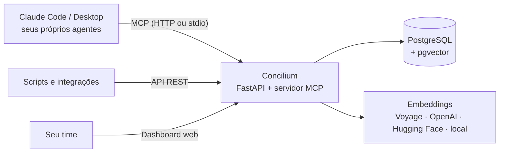

<p align="center">
  
</p>

<h1 align="center">Concilium</h1>

<p align="center">
  <strong>A base de conhecimento open source e self-hosted para agentes de IA.</strong><br />
  Um espaço de notas para o time, como o Obsidian ou o Notion, que o Claude e os seus próprios agentes podem buscar, ler e escrever via MCP.
</p>

<p align="center">
  <a href="README.md">English</a> · <strong>Português</strong> · <a href="README.es.md">Español</a>
</p>

<p align="center">
  
  
  
  
  
  
</p>

<p align="center">
  
</p>

---

## Por que o Concilium?

Ferramentas como **Obsidian**, **Notion** e **Logseq** são ótimas para pessoas. Agentes de IA, porém, precisam de mais do que uma pasta de arquivos Markdown. Eles precisam de uma busca que entenda significado, de um jeito seguro de escrever de volta e de uma memória que passe de um chat para o outro.

**O Concilium é um backend de RAG de verdade, não um vault do Obsidian com arquivos `.md`.** O time escreve notas num espaço web limpo. Cada nota é quebrada em trechos, vetorizada e indexada ao salvar. Qualquer agente conectado via **Model Context Protocol (MCP)** ou pela API REST pode então consultar, inserir e atualizar esse conhecimento, com versionamento e detecção de duplicatas.

Os agentes também ganham uma casa: perfil (system prompt), memória persistente, resumos de sessão e tarefas, tudo guardado no banco. Um chat novo carrega esse contexto e **continua de onde o anterior parou**.

## Recursos

**📝 Espaço de notas do time**
- Pastas, editor visual com aba Markdown, tags e modelos de nota
- `[[Wikilinks]]` e backlinks, no estilo do Obsidian. Links para notas que ainda não existem se conectam sozinhos quando a nota é criada
- **Importação de vault Obsidian**: envie o `.zip` pela dashboard e acompanhe o progresso em tempo real — pastas viram coleções, notas viram documentos com vetorização completa, e re-importar atualiza em vez de duplicar
- Histórico de versões com restauração, detecção de conflito e rascunho local, para nada se perder

**🔎 RAG de verdade para agentes**
- Busca híbrida (**semântica + full-text**) em PostgreSQL + pgvector
- Quebra automática em trechos, versionamento de documentos e **aviso de duplicata** antes de inserir
- Upsert por id externo, para sincronizar com CRM, site de documentação ou qualquer outro sistema

**🤖 Registro de agentes com memória**
- Perfis de agente com system prompt, escopos e as coleções que cada um pode acessar
- Memórias persistentes, resumos de sessão e tarefas: o `load_agent` restaura tudo num chat novo
- Governança com humano no circuito: o agente **propõe** mudanças no próprio perfil, pessoas aprovam, e a autonomia é ligada agente por agente

**🕸️ Grafo de conhecimento**
- Grafo interativo com links explícitos e arestas de similaridade semântica
- Filtro por coleção, limite de similaridade ou nível de documento/trecho, e conexão de documentos com cliques

**🔐 Feito para times**
- Dashboard com métricas de uso, testador de busca RAG, chaves de API com escopos e papéis de usuário (leitor, editor, admin)
- Tema claro e escuro, com a interface em **inglês, português e espanhol**
- Log de auditoria de toda escrita, além de API REST com documentação OpenAPI interativa

**🔌 Embeddings plugáveis**
- Voyage AI, OpenAI, Hugging Face Inference (BAAI/bge-m3) ou um modelo 100% local, todos com 1024 dimensões
- Trocou de provedor? Um único comando `reindex` recalcula todos os vetores

## Telas

| Painel | Grafo de conhecimento |
|---|---|
|  |  |

## Concilium vs. Obsidian, Notion e bancos vetoriais puros

| | **Concilium** | Obsidian | Notion | Só banco vetorial |
|---|:---:|:---:|:---:|:---:|
| Notas do time com Markdown e `[[wikilinks]]` | ✅ | ✅ | ≈ (links e menções) | ❌ |
| Busca híbrida semântica + full-text nativa | ✅ | ❌ (plugins) | ≈ (Notion AI) | ≈ (só semântica) |
| Servidor MCP para o Claude e outros agentes | ✅ nativo | ≈ (plugins da comunidade) | ✅ (hospedado) | ❌ |
| Agentes **escrevem de volta** com versionamento e checagem de duplicata | ✅ | ❌ | ≈ | ❌ |
| Memória, sessões e tarefas de agentes | ✅ | ❌ | ❌ | ❌ |
| Aprovação humana para mudanças dos agentes | ✅ | ❌ | ❌ | ❌ |
| Self-hosted no seu próprio PostgreSQL | ✅ | ✅ (arquivos locais) | ❌ | ✅ |

<sub>A comparação considera os recursos nativos. Plugins e integrações podem acrescentar mais a cada ferramenta.</sub>

**Escolha o Concilium** se o seu time quer uma **alternativa open source ao Obsidian ou ao Notion** feita desde o primeiro dia para **agentes de IA e RAG**: um só lugar onde pessoas escrevem e agentes leem, buscam e aprendem.

## Início rápido

**Requisitos:** Python 3.11+, [uv](https://docs.astral.sh/uv/) e PostgreSQL 16 com a extensão [pgvector](https://github.com/pgvector/pgvector).

```bash
# 1. PostgreSQL com pgvector (pule se você já tem um)
docker run -d --name concilium-db -p 5432:5432 \
  -e POSTGRES_USER=user -e POSTGRES_PASSWORD=password -e POSTGRES_DB=kb \
  pgvector/pgvector:pg16

# 2. Instalar
git clone https://gitlab.com/oadrianolucas/concilium-web-server.git
cd concilium-web-server
uv sync
cp .env.example .env   # defina DATABASE_URL, EMBEDDING_PROVIDER e a chave do provedor

# 3. Rodar (as tabelas são criadas no primeiro start)
uv run mcp-rag-api serve            # http://localhost:8000

# 4. Criar o primeiro usuário da dashboard e abrir http://localhost:8000/dashboard
uv run mcp-rag-api create-user --username voce --role admin

# 5. Criar uma chave de API admin para os seus agentes (exibida uma única vez)
uv run mcp-rag-api create-key --label eu --scopes admin
```

Prefere Docker? O `Dockerfile.coolify` gera a imagem de produção. O `docker-compose.yml` é um exemplo que roda a API ao lado de um container Postgres já existente (rede externa `db_network`).

## Conectar seus agentes

**Claude Code**

```bash
claude mcp add --transport http concilium http://localhost:8000/mcp \
  --header "Authorization: Bearer kb_sk_SUA_CHAVE"
```

O **Claude Desktop** e outros clientes locais podem rodar o servidor via stdio: `uv run mcp-rag-api stdio` (a chave vem do `KB_API_KEY`).

**Seus próprios agentes** (Claude Agent SDK ou qualquer cliente MCP) podem apontar para `https://seu-dominio/mcp` com o header `Authorization: Bearer`. O resto pode usar a API REST, documentada em `/dash/docs` (exige login da dashboard).

Depois é só conversar com o Claude:

> Crie uma coleção chamada "manual" e adicione nossa política de reembolso: o cliente pode pedir reembolso em até 30 dias.
>
> Qual é o prazo de reembolso? Cite a fonte.
>
> Cadastre um agente de suporte que só usa a coleção "manual" e nunca promete reembolso sem consultar a política.

## Como funciona



| Grupo de tools MCP | Tools |
|---|---|
| Base de conhecimento | `search_knowledge`, `get_document`, `list_documents`, `add_document`, `update_document`, `upsert_document`, `archive_document`, `document_history`, coleções |
| Links | `get_related`, `link_documents`, `unlink_documents`, além de `[[Título]]` no conteúdo |
| Agente (sobre si mesmo) | `load_agent`, `recall`, `remember`, `forget`, `save_session`, `upsert_task`, `propose_agent_update`, … |
| Gestão | `create_agent`, `update_agent`, `set_agent_autonomy`, `review_agent_update`, `issue_agent_key`, … |

Prompts: `design_agent`, `start_as_agent`, `answer_with_sources`, `save_learning`.

## Documentação

- **[Guia completo](docs/guide.pt-BR.md)**: instalação, todas as tools MCP, escopos, exemplos REST, manutenção, problemas comuns e deploy em produção
- Documentação interativa da API REST: `http://localhost:8000/dash/docs` (atrás do login da dashboard)
- Arquitetura e decisões: [PLANO.md](PLANO.md)

## Perguntas frequentes

**O Concilium é uma alternativa ao Obsidian?**
Sim, para times. Você tem pastas, Markdown, `[[wikilinks]]`, backlinks e visão em grafo no navegador. Toda nota também pode ser buscada por agentes de IA via MCP, com busca semântica, versionamento e controle de acesso. Ele não substitui um vault pessoal offline: é uma base de conhecimento compartilhada entre pessoas e agentes.

**Dá para usar no lugar do Notion como wiki do time?**
Para o conhecimento que os agentes precisam usar, dá: perfis de cliente, playbooks, runbooks, documentação de produto. O foco do Concilium são notas, busca e agentes, e não bancos de dados, quadros kanban ou edição simultânea em tempo real.

**Consigo importar meu vault do Obsidian ou arquivos Markdown?**
Envie pela API REST (`PUT /documents/upsert`) ou peça ao Claude para adicionar via MCP, e depois rode `uv run mcp-rag-api relink` para resolver todos os `[[wikilinks]]`. Ainda não existe um importador de um clique.

**Funciona com ChatGPT, Cursor ou outras ferramentas de LLM?**
Qualquer cliente que fale o **Model Context Protocol** consegue se conectar. O resto pode usar a API REST. Os embeddings não dependem do modelo de chat.

**O Concilium é open source?**
Sim. O Concilium é distribuído sob a [Licença Apache 2.0](LICENSE): você pode usar, modificar e hospedar, inclusive para fins comerciais.

**Meus dados ficam privados?**
O Concilium é self-hosted: notas, vetores e memórias dos agentes ficam no seu próprio PostgreSQL. Com o provedor de embeddings `local`, nenhum texto sai do seu servidor.

**Quais modelos de embedding são suportados?**
Voyage AI (`voyage-3.5`), OpenAI (`text-embedding-3-small`), Hugging Face Inference (`BAAI/bge-m3`) e `BAAI/bge-m3` local via sentence-transformers. Todos usam 1024 dimensões.

## Licença

O Concilium é open source, sob a [Licença Apache 2.0](LICENSE).

## Stack

Python 3.12 · FastAPI · MCP Python SDK · asyncpg com SQL puro · PostgreSQL 16 + pgvector · dashboard em JavaScript puro (sem build) com Toast UI Editor e force-graph · uv · pytest · ruff.

---

<p align="center">
  <sub>Concilium: base de conhecimento open source e compartilhada, segundo cérebro e memória RAG para times e seus agentes de IA.</sub>
</p>
